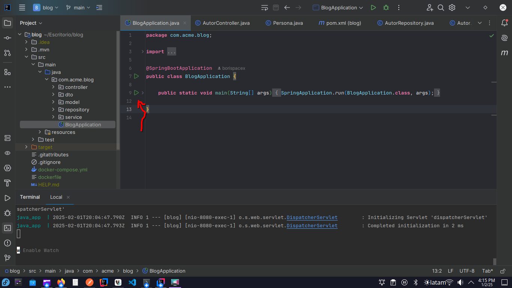
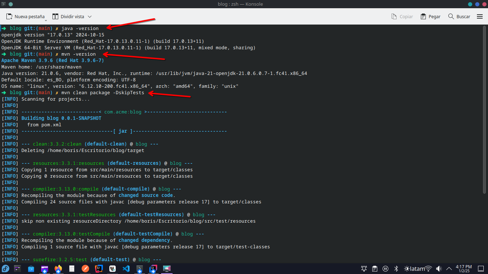
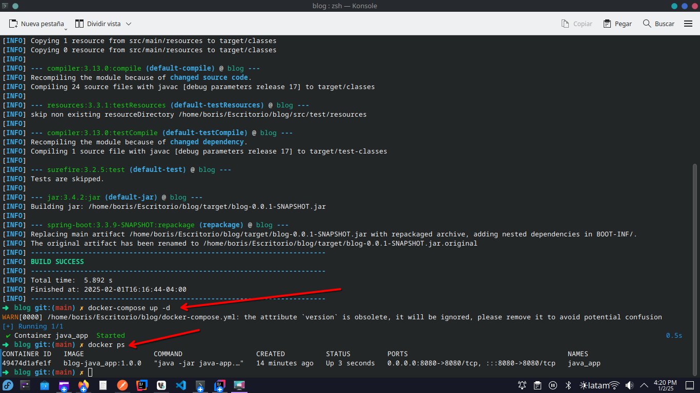
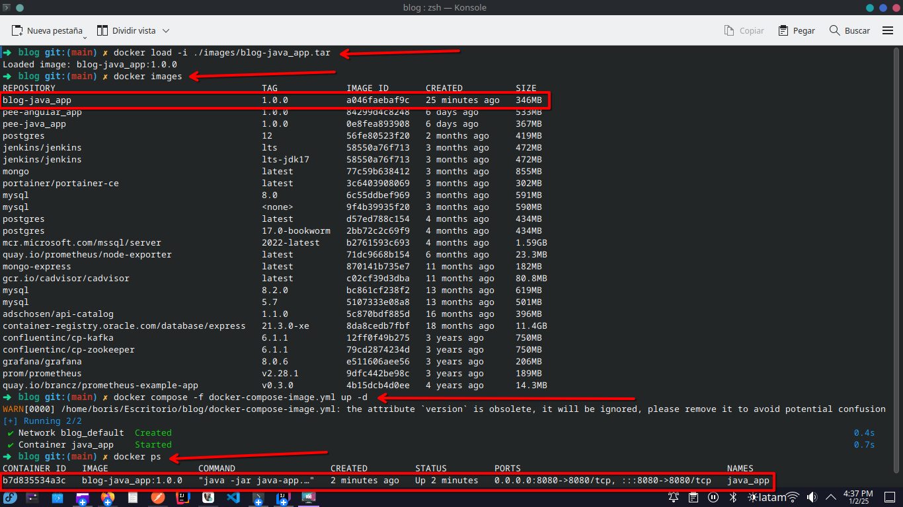

# API REST BLOG
## SOLUCIÓN
Solución a los requerimientos solicitados se decidio utilizar el framework SpringBoot para hacer el despliegue de la API REST, sin el uso de base de datos asi guardando datos a nivel aplicación.

## TECNOLOGIAS
La tecnologia principal que se utilizo fue:
- Java 17 o superior
- Maven 3.3.8 o superior

## PRODUCCIÓN
Para realizar el despliegue de la aplicacion utilizaremos docker y docker-compose para hacerlo mas sencillo.
Para poder levantar con docker tenemos dos opciones (NOTA: Solo utilizar una)
### OPCIÓN 1
Levantar con un editor de codigo como ser Intellij IDEA y levantarlo. Nota antes configurando correctamente el Maven 3 y Java 17.

### OPCIÓN 2
Si usted cuenta con maven 3.3.8 o superior o Java 17. Ejecutar los siguientes comandos:
- Crear el compilado JAR
```
mvn clean package -DskipTests
```
- Crear una imagen por el JAR compilado y crear el contendor
```
docker-compose up -d
```


### OPCIÓN 3
Si no cuenta con con lo demas solo necesitara Docker para levantar el API REST.
- Cargar la imagen de nuestra api a nuestro Docker
```
docker load -i ./images/blog-java_app.tar
```
- Crear el contendor
```
docker compose -f docker-compose-image.yml up -d
```

